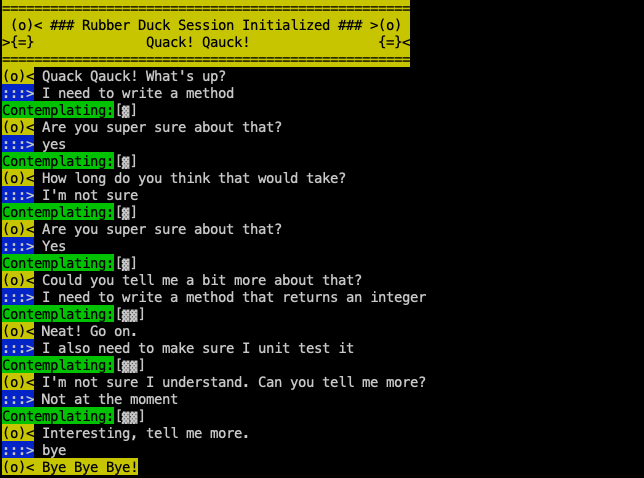
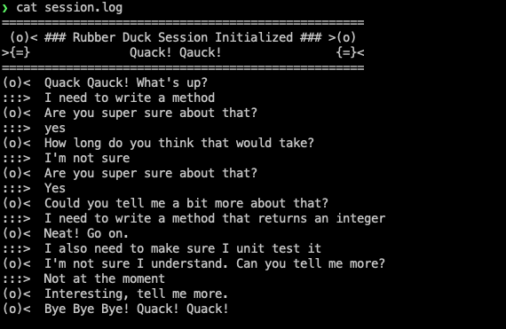
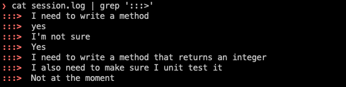

# rduck.sh

A terminal script for talking to yourself.

Start a conversation `./rduck.sh`

End a conversation by typing `bye`

Conversation log stored in the current folder as `session.log`

View your answers in the session log `cat session.log | grep ':::>'`

## Demo ##

## Script View ##

## Log View

## Answers View

